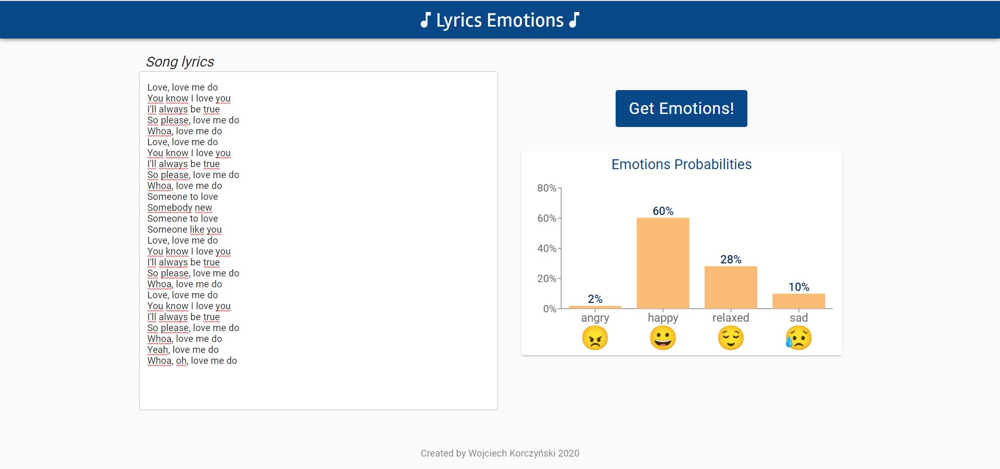

# Song lyric classification

## General description

Engineer thesis project which aim is to create song emotions classification model basing on lyrics. It uses NLP methods and machine learning methods to classify a lyrics to one from below classes:
- angry
- happy
- sad
- relaxed

Each lyrics go through the preprocessing process. To extract features word embedding method is applied.

Used machine learning models for classification:
 - multilayer perceptron (MLP)
 - long short-term memory (LSTM)
 - gate recurrent unit (GRU)
 - convolutional net (CNN)

There are also variants of these models (apart from GRU) which work on fragments (verses, choruses)
of lyrics. 

The project includes the web application which allows to predict a song emotion basing on its lyrics, using the created model.

Almost all code is written in Python. All needed packages are listed in `requirements.txt`. They can be downloaded:
```
pip install -r requiremtns.txt
```
The frontend of the web application is written using React.js.

## Getting dataset

The `.csv` files with dataset are located in `/datasets` directory. It consists of training, validation and test datasets. 

The process of getting the datasets can be repeated by running scripts from `/scripts/datasets` in the follwoing order:
  1. `download_raw_dataset` - it downloads raw data about songs and their emotions from three sources: [PMemo2019](https://github.com/HuiZhangDB/PMEmo), [emoMusic](http://cvml.unige.ch/databases/emoMusic/),
  [MoodyLyrics4Q](http://softeng.polito.it/erion/). All needed files are saved in `/datasets` folder.
  2. `merge_raw_datasets` - it merges three datasets into one. It drops redundant data, standarize and normalize data, extract classes (happy, relaxed, sad, angry) for those data which are in nummerical format of valance and  arousal values. The result is saved as `merged_datasets.csv` file.
  3. `get_lyrics_to_dataset` - it downloads the lyrics for the songs using  LyricsGenius API. It also download music genres for songs form `theaudiodb.com`. By means of `langdetect` library non-english songs are filtered out. The result is saved as `merged_datasets.csv` file. Beacaus of a lot of API requests an execution of the script can take long time.
  4. `filter_data_with_lyrics` - it filters out records from `merged_datasets.csv`:
     - deleting manually chosen data whoch consist incorrect or junk lyrics,
     - deleting records with too long lyrics,
     - deleting duplicated song data,
     - generalizing  music genres into 7 categories
    The result is saved as `filtered_dataset_with_lyrics.csv`.
  5. `split_dataset` - script splitting the dataset into training, validation and testing datasets.

The presentation and visualization of the whole dataset (`filtered_dataset_with_lyrics.csv`) is included in the Jupyter notebook in `/notebooks` directory.
## Text preprocessing

The project consist text preprocessing functions. They are located in file `text_preprocessing.py` in `/preprocessing` folder. It consist of following functions:
- a basic preprocessing function which lowers words, removes punctuation and digits, removes redundant white spaces
- removing stop words function
- lemmatizating text function

During preprocessing some steps can be omitted, e.g. removing stop words and/or lemmatization.

## Feature extraction

To extract features word embedding methodology is used. The project utilizes fastText method.

The class of fastText model `WordEmbedder` is located in `/models/word_embedding/word_embedder.py`. It loads fastText model in `.bin` format from `/models/word_embedding/saved_models`. The exact name of model can be passed in constant `_MODEL_PATH`. 

Getting embedding for a given word:
```
word = 'cat'
embedder = WordEmbedder()
embedding =  embedder[word]
```
There is a script `create_fasttext_model` which creates a fastText model in `bin` format which can be afterward used. It has following paramters:
 - `dim` - dimmension of a being created model, default: `200`.
 - `large_dataset` - boolean value indicating whether use a large dataset with lyrics or a training dataset `train_dataset.csv`, default: `True`.
    
    A large dataset is not included in the repository due to its large size. There are two ways of obtaining it:
    1. it can be download from [Song lyrics from 6 musical genres](https://www.kaggle.com/neisse/scrapped-lyrics-from-6-genres) and should be extracted to `/datasets/lyrics-data` directory
    2. running `download_large_lyrics_dataset` from `/scripts/datasets`. It demands to have `.json` file `kaggle.json` with your kaggle account token in your HOME directory
 - `remove_stopwords` - boolean value indicating whether to remove stopwords from dataset befor creating a fastext model, default: `True`.
 - `lemmatization` - boolean value indicating whether to remove stopwords from dataset befor creating a fasText model, default: `False`.
 
A saved model is located in `models/word_embedding/saved_models`.
   
## Classification models
  
All models are implemented using PyTorch library with PyTorch Lightning wrapper. The models are located in `/models` directory in separated subdirectories for different model kinds. 
  
Objects of `LyricsDataset` class (in file `lyrics_dataset.py`) which extends PyTorch `Dataset` class are used as datasets . They obtain data from Pandas `DataFrame` or `.csv` files and apply text processing of lyrics. They return tuples of embeddings array of words in lyrics and an emotion class label.
  
Every model is trained using scripts from `scripts/training` folder. Every model and training can be adjusted with own hyperparameters. The trained models are saved in subdirectories `../saved_models` appropriate for each model type.

During traing Tensorboard logs are created. They are saved in `/scripts/lightning_logs/<model_type>`. They can be displayed in a browser using terminal command:
```
tensorboard --logdir /scripts/lightning_logs/<model_type>
```
  
Evaluation of the models with the training dataset can be performed by running the scripts from `/scripts/evaluation`. A prediction of a single lyrics input can be performed using `predict(lyrics: str)`function which returns a label of predicted class and an array of probabilities of all classes, e.g.:
```
lyrics = 'lyrics of song'
mlp_model = MLPClassifier(**hyperparameters)
mlp_model.load_state_dict(torch.load(_MLP_MODEL_PATH, map_location=_DEVICE))
encoded_label, probabilities = mlp_model.predict(lyrics)
```
More examples of usage is in file `/scripts/evaluation/predict_emotion.py`.
  
There are following kinds of models:
- MLP which as input takes average embedding of all embedding in lyrics
- Recurrent models (LSTM, GRU) which as an input take a sequence of `max_num_words` first words of lyrics
- Convolutional net (CNN()) model which as input takes a matrix of dimensions `max_num_words` by `embedding_dim`. In the case when lyrics have fewer words it is padded with zeros.
  
There are variants of MLP, LSTM and CNN models which inputs are in the form of fragments representing subsequent fragments of text. As a prediction for one song an average of fragments prediction is calculated. These models are in files with `fragmentized_` prefix. They use other `Dataset` class - `FragmentizedLyricsDataset` (in file `fragmentized_lyric_dataset.py`) which returns list of embeddings arrays corresponding to each lyrics fragment. 

In that dataset lyrics are divided into fragments using `fragmentize_text` function from `text_preprocessor` file. It divides text basing on inline tags in squared bractes, e.g. `[CHORUS]`. If there is no such tags it returns fragments with equal number of words.

There is an option to train MLP and CNN models with SMOTE upsampled training dataset:
 - For MLP model `smote` parameter of model has to be `True`. Then `UpsampledAverageEmbeddingDataset` (from `upsampled_avg_embedding_dataset.py`) is used as training datasets. It upsamples less numbered classes based on average embedding features. 
 - For CNN model `smote` parameter of model has to be `True`. Then `UpsampledSequenceEmbeddingDataset` (from `upsampled_sequence_embedding_dataset.py`) is used as training datasets. It upsamples less numbered classes based on embeddings of `max_num_words` first words of lyrics.
  
## Web application
The web application consists of backend app written in Python using Flask and frontend app written with React.js with usage of material-ui components.

### Backend 
Backend application contains one POST method under `/song_emotion` with one parameter `lyrics` containing lyrics af a song for which we want predict emotions. Its response is in JSON format and includes emotion classes with probabilities, e.g.:
```
{
    "angry": 0.43564414978027344,
    "happy": 0.3825746476650238,
    "relaxed": 0.07612542808055878,
    "sad": 0.10565581917762756
}
```
The method uses a saved ML model together with a saved FastTExt model. Currently it is written to use convolutional net class (but can be easily switched with another of available classes).

The api is exposed on default port 5000. The files of the app are in `/backend_app` localization.

### Frontend
The frontend app is located in `/fronted_app`. In order to run it type in terminal
```
cd frontend_app
npm install
npm start
```


